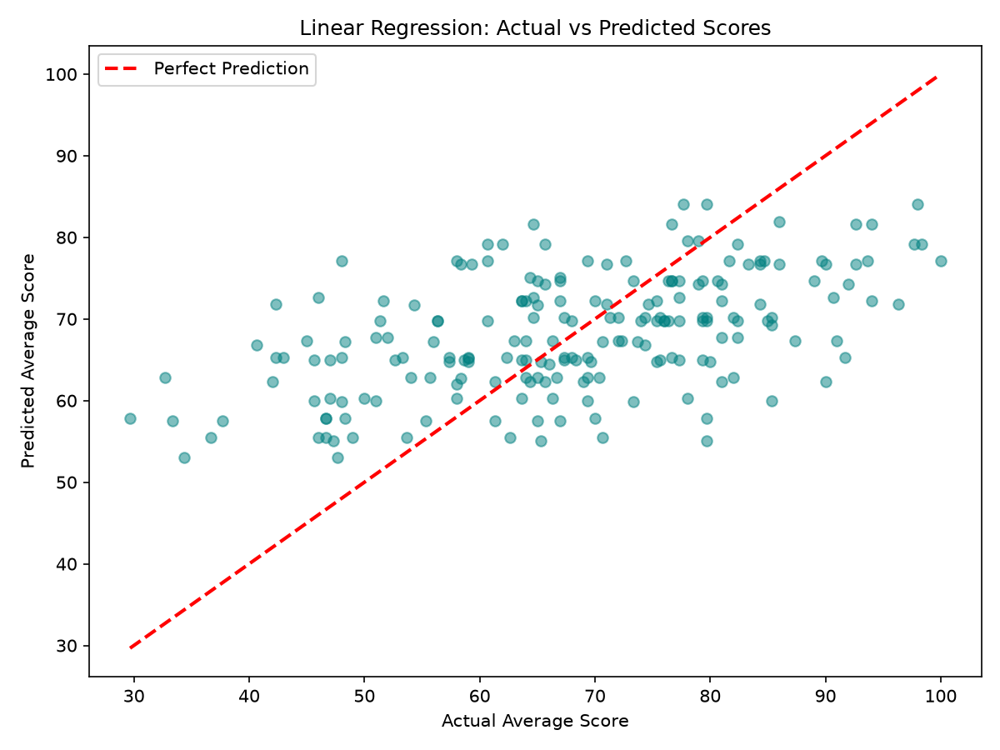
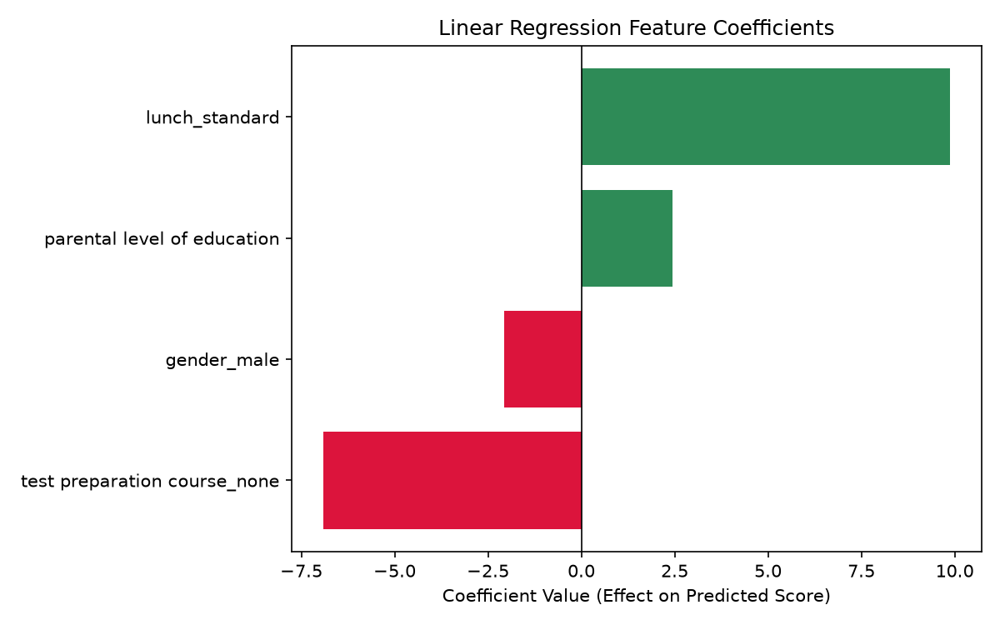

# Student Average Score Predictor — Regression Project

A complete end-to-end regression ML project: from raw exam data to a locally deployed
FastAPI + Streamlit web app. Built by Javed as a hands-on follow-up to the
[Diabetes Prediction (Classification) project](https://github.com/mirza-javed/diabetes-prediction-app),
on the path to becoming an Agentic AI Developer/Engineer.

**Live App**: https://student-score-prediction-app-sqr6gdwf8ipuf7iqykue5o.streamlit.app/

**GitHub Repo**: https://github.com/mirza-javed/student-score-prediction-app.git




---

## 1. Dataset & Problem

- **Dataset**: Students Performance in Exams (`exams.csv`)
- **Goal**: Predict a student's **average exam score** (Math + Reading + Writing ÷ 3)
  from background/demographic factors — a **regression** problem (predicting a continuous
  number), unlike the diabetes project's classification (Diabetic / Not Diabetic).
- **Original columns**: gender, race/ethnicity, parental level of education, lunch,
  test preparation course, math score, reading score, writing score.

---

## 2. Target Engineering

Rather than predicting a single subject score (e.g., Math) using the other two subject
scores as features, a single **`average_score`** target was engineered:

```python
df['average_score'] = (df['math score'] + df['reading score'] + df['writing score']) / 3
```

**Why not use Reading/Writing scores to predict Math score?**
Subject scores are highly correlated with each other — they're different measurements
of the *same* underlying academic ability. Using one to predict another lets a model
"cheat" via correlation rather than learning anything about genuine, independent
background factors. `average_score` avoids this by keeping the target and the features
conceptually separate: **background factors → overall performance**, not
**one test score → another test score**.

The three raw subject-score columns were **dropped** from the feature set after
computing `average_score`, since keeping them would leak the answer directly into
the model (average = perfect giveaway).

---

## 3. A Fairness Decision — Excluding `race/ethnicity`

The dataset includes an anonymized `race/ethnicity` column (Group A–E) that does show
a statistical association with scores. It was **deliberately excluded from modeling**.

**Reasoning**: while it technically correlates with the target, using a protected
characteristic like ethnicity as a predictive input risks encoding and reinforcing
societal bias rather than offering genuine, actionable insight. Unlike "completed
test preparation" — something a student or school can act on — a person's ethnicity
isn't something they should be predicted or judged by. This mirrors well-documented
fairness concerns in real-world ML systems (loan approval, hiring, criminal justice).

`race/ethnicity` was explored during EDA (useful for understanding the data) but
dropped before defining features (X).

---

## 4. Encoding Categorical Variables

Two different encoding strategies were used, depending on whether a category has a
natural order:

| Column | Type | Method |
|---|---|---|
| `gender`, `lunch`, `test preparation course` | Nominal (no order) | One-hot encoding (`pd.get_dummies`, `drop_first=True`) |
| `parental level of education` | Ordinal (has order) | Manual mapping preserving rank |

```python
# One-hot encoding for nominal categories
df = pd.get_dummies(df, columns=['gender', 'lunch', 'test preparation course'], drop_first=True)

# Ordinal encoding — preserves the real-world rank of education levels
education_order = {
    'some high school': 0,
    'high school': 1,
    'some college': 2,
    "associate's degree": 3,
    "bachelor's degree": 4,
    "master's degree": 5
}
df['parental level of education'] = df['parental level of education'].map(education_order)
```

**Why the distinction matters**: one-hot encoding treats categories as unordered
(e.g., it wouldn't make sense to say "male > female"). Ordinal encoding is used
for parental education specifically because EDA showed a genuine, roughly increasing
trend in average score as education level rose — treating it as unordered nominal
data would throw that information away.

**Final feature set** (4 features): `parental level of education`, `gender_male`,
`lunch_standard`, `test preparation course_none`.

---

## 5. Exploratory Data Analysis — Signal Strength

Average score, grouped by each categorical feature:

| Feature | Gap in Avg Score | Strength |
|---|---|---|
| Lunch type (standard vs free/reduced) | ~10.5 pts | 🔴 Strong |
| Parental education (master's vs some high school) | ~11.8 pts | 🟠 Strong, ordered |
| Test preparation course (completed vs none) | ~7.7 pts | 🟠 Strong |
| Gender (female vs male) | ~2.4 pts | 🟢 Mild |

`lunch type` — a known proxy for socioeconomic status in the dataset's original
context — showed the single largest gap of any feature checked.

---

## 6. Train/Test Split

```python
X_train, X_test, y_train, y_test = train_test_split(
    X, y, test_size=0.2, random_state=42
)
```

**No `stratify=y` this time** — `stratify` balances the *proportion of categories*
across train/test, which only makes sense for a classification target with fixed
classes. `average_score` is continuous, with no fixed categories to balance, so a
plain random split is the correct approach for regression.

---

## 7. Preprocessing — No Scaling Needed

Unlike the diabetes project (which used `StandardScaler` for Logistic Regression),
no scaler was used here:

- 3 of the 4 features are binary (0/1)
- The 4th (`parental level of education`) only ranges 0–5

None of these are on wildly different scales (unlike, say, Insulin's 0–800 range in
the diabetes dataset), so Linear Regression doesn't risk one feature dominating due
to magnitude alone.

```python
pipeline = Pipeline([
    ('regressor', LinearRegression())
])
```

---

## 8. Model Comparison — Reasoning Over Numbers

| Model | MAE | RMSE | R² |
|---|---|---|---|
| **Linear Regression** ✅ | **10.47** | **12.71** | **0.271** |
| Random Forest | 10.52 | 12.98 | 0.240 |

**Key lessons**:

- **A more flexible/powerful algorithm isn't automatically better.** Random Forest's
  strength is finding complex, non-linear relationships across many features. With
  only 4 simple features (3 binary, 1 small-range ordinal), there was little
  non-linear complexity for it to exploit — its extra flexibility became a mild
  disadvantage (some overfitting to noise), rather than an advantage.
- This is the mirror image of the diabetes project's lesson, where the more complex
  model (Random Forest) *did* win — reinforcing the same underlying principle:
  **model choice should match the true structure of the data, not just algorithm
  reputation.**
- **Linear Regression was chosen** for its slightly better performance on every
  metric, plus its interpretability advantage — its coefficients directly show the
  size and direction of each feature's effect (see below).

---

## 9. Understanding the Model — Coefficients

```python
lr_model = pipeline.named_steps['regressor']
coefficients = pd.DataFrame({
    'Feature': X_train.columns,
    'Coefficient': lr_model.coef_
})
```

| Feature | Coefficient | Interpretation |
|---|---|---|
| `lunch_standard` | **+9.87** | Standard lunch (vs free/reduced) adds ~9.9 points — the single largest effect |
| `test preparation course_none` | **−6.92** | Not completing test prep subtracts ~6.9 points |
| `parental level of education` | **+2.44** | Each step up the education scale adds ~2.4 points |
| `gender_male` | **−2.07** | Being male (vs female) is associated with ~2.1 points lower |
| **Intercept** | **61.98** | Baseline prediction for a female student, parent's education = "some high school", free/reduced lunch, who *did* complete test prep |

All coefficient directions and rough magnitudes matched the EDA groupby findings,
which is a useful sanity check that the model learned genuine, sensible relationships
rather than something spurious.


---

## 10. Model Evaluation — Actual vs. Predicted


If the model were "perfect," every point would sit exactly on the red diagonal line.
Instead, predictions cluster loosely around it — visually confirming the R² of 0.27.
Notably, predictions are pulled toward the middle for very low and very high actual
scores; the model isn't confident predicting extremes given the limited features
available.

**Interpretation**: background factors like lunch type, parental education, and test
preparation do meaningfully influence scores — but they explain roughly a quarter of
the variation in outcomes. The remaining ~73% likely reflects individual factors not
captured in this dataset, such as personal study habits, natural aptitude, or exam-day
performance. These demographic factors should be read as **contributing influences,
not deterministic predictors** of any one student's score.

An R² in the 0.15–0.40 range is typical and expected for social/behavioral prediction
problems like this one — a much higher R² from just 4 demographic proxies would
actually be a red flag for data leakage, not a sign of a great model.

---

## 11. Saving & Loading the Model

```python
import joblib
joblib.dump(pipeline, 'student_score_model.pkl')
loaded_pipeline = joblib.load('student_score_model.pkl')
```

Saves the entire pipeline (just the fitted `LinearRegression` here, since no scaler
was needed) as one reusable object.

**Environment consistency**: as with the diabetes project, the model was trained and
will be deployed from the **same local `venv`**, avoiding the scikit-learn
version-mismatch issue encountered previously when mixing Colab and local environments.

---

## 12. Backend API — FastAPI

A key design decision in this project (not needed in the diabetes project, since all
its features were already numeric): the API accepts **human-readable inputs**
(`"male"`, `"bachelor's degree"`, etc.) rather than pre-encoded numbers, and encodes
them internally before prediction.

```python
from fastapi import FastAPI
from pydantic import BaseModel
from typing import Literal
import joblib, pandas as pd

app = FastAPI()
model = joblib.load('student_score_model.pkl')

class StudentData(BaseModel):
    gender: Literal['male', 'female']
    parental_level_of_education: Literal[
        'some high school', 'high school', 'some college',
        "associate's degree", "bachelor's degree", "master's degree"
    ]
    lunch: Literal['standard', 'free/reduced']
    test_preparation_course: Literal['completed', 'none']

def encode_input(data: StudentData) -> pd.DataFrame:
    education_order = {
        'some high school': 0, 'high school': 1, 'some college': 2,
        "associate's degree": 3, "bachelor's degree": 4, "master's degree": 5
    }
    return pd.DataFrame([{
        'parental level of education': education_order[data.parental_level_of_education],
        'gender_male': 1 if data.gender == 'male' else 0,
        'lunch_standard': 1 if data.lunch == 'standard' else 0,
        'test preparation course_none': 1 if data.test_preparation_course == 'none' else 0
    }])

@app.post("/predict")
def predict(data: StudentData):
    input_df = encode_input(data)
    prediction = model.predict(input_df)[0]
    return {"predicted_average_score": round(float(prediction), 2)}
```

**Key lessons**:

- **`Literal` types instead of plain `str`** — restricts each field to its exact set
  of valid values. This is stricter (and safer) than a free-text field: a mismatched
  category like `"Male"` (capital M) would previously have been silently treated as
  `0` (i.e., misread as "female") rather than rejected. With `Literal`, FastAPI
  automatically returns a clear `422 Validation Error` for anything outside the
  allowed values, before the prediction code ever runs.
- **Encoding logic lives entirely in the backend**, not duplicated across the frontend
  — a single source of truth for how raw input maps to model-ready numbers.
- **Manual encoding must exactly mirror the training-time encoding** — same
  dictionary, same category-to-number mapping, same column names and order as
  `X_train`, or predictions will be silently wrong.
- Regression predictions use `.predict()` only — no `.predict_proba()`, since that's
  a classification-only concept.
- Verified with `http://127.0.0.1:8000/docs` by hand-calculating a prediction from the
  coefficients and confirming it matched the API's output exactly.

---

## 13. Frontend — Streamlit

```python
import streamlit as st
import requests

st.set_page_config(page_title="Student Score Predictor", layout="centered")
st.title("🎓 Student Average Score Predictor")

gender = st.selectbox("Gender:", ['male', 'female'])
parental_level_of_education = st.selectbox("Parental Level of Education:", [
    'some high school', 'high school', 'some college',
    "associate's degree", "bachelor's degree", "master's degree"
])
lunch = st.selectbox("Lunch Type:", ['standard', 'free/reduced'])
test_preparation_course = st.selectbox("Test Preparation Course:", ['completed', 'none'])

if st.button("Predict Score"):
    input_data = {
        "gender": gender,
        "parental_level_of_education": parental_level_of_education,
        "lunch": lunch,
        "test_preparation_course": test_preparation_course
    }
    response = requests.post("http://127.0.0.1:8000/predict", json=input_data)
    result = response.json()
    st.success(f"Predicted Average Score: {result['predicted_average_score']}")
```

**Key lessons**:

- **`st.selectbox(label, options)`** — creates a dropdown for fixed-category inputs
  (vs. `st.number_input` for numeric fields like Age/BMI in the diabetes app).
- The dropdown options must **exactly match** the backend's `Literal` values —
  a mismatch here would cause every request to fail validation.
- `streamlit` builds the UI; the separate `requests` library is what actually sends
  the `POST` request to the FastAPI backend and receives the JSON response.

---

## 14. Visualizations

Two charts were generated to support the README and communicate model behavior
visually, matching best practice from the diabetes project's feature-importance chart:

1. **`feature_coefficients.png`** — horizontal bar chart of the model's learned
   coefficients, colored by direction (green = increases score, red = decreases score).
2. **`actual_vs_predicted.png`** — scatter plot of actual vs. predicted scores on the
   test set, with a red dashed "perfect prediction" reference line, to visually
   represent the RMSE/R² findings rather than just stating them as numbers.

```python
import matplotlib.pyplot as plt

# Actual vs Predicted
plt.figure(figsize=(8, 6))
plt.scatter(y_test, y_pred_lr, alpha=0.5, color='teal')
plt.plot([y_test.min(), y_test.max()], [y_test.min(), y_test.max()], 'r--', linewidth=2, label='Perfect Prediction')
plt.xlabel("Actual Average Score")
plt.ylabel("Predicted Average Score")
plt.title("Linear Regression: Actual vs Predicted Scores")
plt.legend()
plt.savefig('actual_vs_predicted.png', dpi=150)

# Feature Coefficients
coefficients = coefficients.sort_values('Coefficient')
colors = ['crimson' if c < 0 else 'seagreen' for c in coefficients['Coefficient']]
plt.figure(figsize=(8, 5))
plt.barh(coefficients['Feature'], coefficients['Coefficient'], color=colors)
plt.axvline(x=0, color='black', linewidth=0.8)
plt.xlabel("Coefficient Value (Effect on Predicted Score)")
plt.title("Linear Regression Feature Coefficients")
plt.savefig('feature_coefficients.png', dpi=150)
```

---

## 15. Tech Stack

- **Language**: Python
- **Data handling**: pandas, NumPy
- **Modeling**: scikit-learn (LinearRegression, RandomForestRegressor, Pipeline)
- **Visualization**: matplotlib
- **Backend API**: FastAPI, Pydantic, Uvicorn
- **Frontend**: Streamlit
- **Model persistence**: joblib
- **Version control**: Git & GitHub

---

## 16. How to Run Locally

```powershell
# 1. Clone the repo and enter the folder
git clone <your-repo-url>
cd student-score-prediction

# 2. Create and activate a virtual environment
python -m venv venv
venv\Scripts\activate        # Windows
# source venv/bin/activate   # Mac/Linux

# 3. Install dependencies
pip install pandas numpy scikit-learn matplotlib joblib fastapi uvicorn streamlit requests

# 4. Train the model (creates student_score_model.pkl)
python train_model.py

# 5. Start the FastAPI backend (in one terminal)
uvicorn main:app --reload

# 6. Start the Streamlit frontend (in a second terminal)
streamlit run app.py
```

Test the API directly at `http://127.0.0.1:8000/docs`, or use the Streamlit UI at
`http://localhost:8501`.

---

## 17. Project Structure

```
student-score-prediction/
├── exams.csv
├── train_model.py
├── student_score_model.pkl
├── main.py
├── app.py
├── actual_vs_predicted.png
├── feature_coefficients.png
├── README.md
└── venv/
```

---

## 18. Limitations

- **Low-to-moderate R² (0.27)** by design — only 4 background/demographic features
  were used; the model does not capture individual factors like study habits, effort,
  or exam-day performance, which likely account for most of the unexplained variance.
- **`race/ethnicity` intentionally excluded** from modeling for fairness reasons,
  despite showing a statistical association with scores in EDA — a deliberate
  accuracy/fairness trade-off, not an oversight.
- **Dataset origin/population is unspecified/anonymized** — as with the diabetes
  project's population-bias caveat, this model's learned relationships may not
  generalize to a different school system, country, or student population without
  re-validation.
- **Small feature set** — richer data (attendance, study hours, prior grades) would
  likely raise R² meaningfully, but wasn't available in this dataset.

---

## 19. Future Improvements

- Add richer, ethically appropriate features (e.g., study hours, attendance) if a
  suitable dataset becomes available.
- Deploy a standalone Streamlit version (model loaded directly, no separate FastAPI
  backend) to Streamlit Community Cloud, mirroring the diabetes project's
  `app_hf.py` pattern.
- Add cross-validation for a more robust performance estimate than a single train/test split.
- Explore regularized linear models (Ridge/Lasso) as a middle ground between plain
  Linear Regression and Random Forest.

---

## Big-Picture Takeaways

1. **Regression and classification require different evaluation tools** — MAE/RMSE/R²
   instead of Precision/Recall/F1, and no `stratify` on a continuous target.
2. **A feature correlating with the target isn't automatically a good feature** —
   the distinction between an independent, upstream cause (e.g., test prep) and a
   duplicate measurement of the same underlying outcome (e.g., another exam score)
   matters more than raw correlation strength.
3. **Model complexity should match data complexity** — a simple, few-feature, mostly
   linear relationship favored the simpler model here, the opposite conclusion from
   the diabetes project, arrived at through the same disciplined comparison process.
4. **A low R² can be an honest, correct result**, not a failure — especially for
   human/behavioral outcomes influenced by many unmeasured factors.
5. **Fairness is a modeling decision, not just an ethics footnote** — excluding a
   protected characteristic despite its predictive value was a deliberate trade-off,
   documented and defended here rather than silently made.
6. **API design should hide implementation details from the user** — encoding raw,
   human-readable input into model-ready numbers belongs in the backend, verified by
   hand-calculating predictions against the model's actual coefficients.

---

*This project is a strong regression counterpart to the diabetes classification
project, and reuses the same end-to-end structure: clean → engineer target →
encode → split → pipeline → compare models → interpret → save → API → UI →
visualize → document.*
